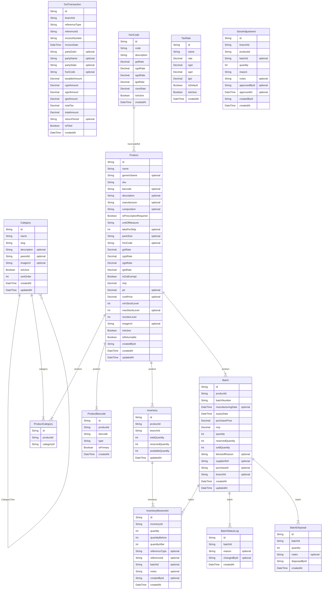

# Catalog, Inventory & Batch Management

> Auto-generated by `scripts/graphify` — source of truth: `prisma/schema.prisma` · `models: 13` · `FK relations: 11` · `enums: 6`

## Enums

| Enum | Values |
|---|---|
| `DrugSchedule` | `NONE`, `H`, `H1`, `X`, `G`, `J` |
| `MovementType` | `IN`, `OUT`, `ADJUSTMENT`, `RETURN_IN`, `RETURN_OUT`, `TRANSFER`, `WRITE_OFF` |
| `AdjustmentType` | `PHYSICAL_COUNT`, `DAMAGE`, `THEFT`, `EXPIRY`, `CORRECTION`, `OPENING_STOCK` |
| `AdjustmentStatus` | `PENDING`, `APPROVED`, `REJECTED` |
| `BatchStatus` | `ACTIVE`, `BLOCKED`, `EXPIRED`, `DISPOSED`, `EXHAUSTED` |
| `DisposalReason` | `EXPIRED`, `DAMAGED`, `RECALLED`, `CONTAMINATED`, `OTHER` |

## Models in this ERD

| Model | Table | Fields | Notes |
|---|---|---|---|
| `Category` | `categories` | 13 |  |
| `Product` | `products` | 39 |  |
| `ProductBarcode` | `product_barcodes` | 7 |  |
| `ProductCategory` | `product_categories` | 5 |  |
| `GstTransaction` | `gst_transactions` | 20 |  |
| `HsnCode` | `hsn_codes` | 11 |  |
| `TaxRate` | `tax_rates` | 9 |  |
| `Inventory` | `inventory` | 10 |  |
| `InventoryMovement` | `inventory_movements` | 14 |  |
| `StockAdjustment` | `stock_adjustments` | 14 |  |
| `Batch` | `batches` | 24 |  |
| `BatchDisposal` | `batch_disposals` | 8 |  |
| `BatchStatusLog` | `batch_status_log` | 8 |  |

---
*Auto-generated by Graphify — do not edit. Regenerate with `npm run graphify`.*
