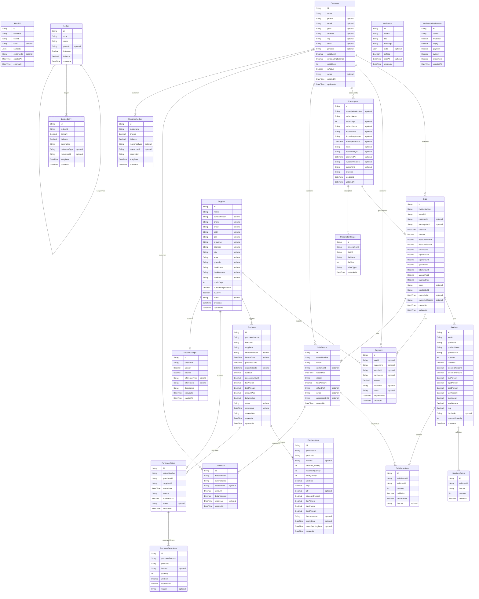

# Sales, Purchasing, Customers, Finance & Tax

> Auto-generated by `scripts/graphify` — source of truth: `prisma/schema.prisma` · `models: 22` · `FK relations: 24` · `enums: 13`

## Enums

| Enum | Values |
|---|---|
| `SaleStatus` | `COMPLETED`, `CANCELLED`, `PARTIALLY_RETURNED`, `FULLY_RETURNED` |
| `PaymentStatus` | `PAID`, `PARTIAL`, `CREDIT`, `OVERPAID` |
| `PaymentMethod` | `CASH`, `CARD`, `UPI`, `NETBANKING`, `CHEQUE`, `CREDIT`, `WALLET` |
| `PrescriptionStatus` | `PENDING`, `APPROVED`, `REJECTED`, `DISPENSED`, `EXPIRED` |
| `PurchaseStatus` | `DRAFT`, `ORDERED`, `PARTIALLY_RECEIVED`, `RECEIVED`, `INVOICED`, `CANCELLED` |
| `PurchaseReturnStatus` | `PENDING`, `APPROVED`, `DISPATCHED`, `COMPLETED`, `CANCELLED` |
| `SaleReturnStatus` | `PENDING`, `APPROVED`, `REFUNDED`, `CREDITED`, `REJECTED` |
| `RestockDecision` | `RESTOCK`, `QUARANTINE`, `DAMAGE_WRITE_OFF` |
| `CreditNoteStatus` | `ACTIVE`, `PARTIALLY_USED`, `FULLY_USED`, `EXPIRED`, `CANCELLED` |
| `LedgerEntryType` | `DEBIT`, `CREDIT` |
| `LedgerType` | `ASSET`, `LIABILITY`, `EQUITY`, `INCOME`, `EXPENSE` |
| `GstTxType` | `B2B`, `B2C`, `EXPORT`, `NIL_RATED` |
| `NotificationType` | `LOW_STOCK`, `EXPIRY_ALERT`, `PURCHASE_DUE`, `PAYMENT_DUE`, `PRESCRIPTION_PENDING`, `SYSTEM`, `INFO` |

## Models in this ERD

| Model | Table | Fields | Notes |
|---|---|---|---|
| `Payment` | `payments` | 14 |  |
| `Sale` | `sales` | 31 |  |
| `SaleItem` | `sale_items` | 23 |  |
| `SaleItemBatch` | `sale_item_batches` | 7 |  |
| `HeldBill` | `held_bills` | 8 |  |
| `Prescription` | `prescriptions` | 21 |  |
| `PrescriptionImage` | `prescription_images` | 8 |  |
| `Purchase` | `purchases` | 26 |  |
| `PurchaseItem` | `purchase_items` | 21 |  |
| `PurchaseReturn` | `purchase_returns` | 13 |  |
| `PurchaseReturnItem` | `purchase_return_items` | 9 |  |
| `Customer` | `customers` | 22 |  |
| `CustomerLedger` | `customer_ledgers` | 11 |  |
| `Supplier` | `suppliers` | 25 |  |
| `SupplierLedger` | `supplier_ledgers` | 11 |  |
| `CreditNote` | `credit_notes` | 11 |  |
| `SaleReturn` | `sale_returns` | 17 |  |
| `SaleReturnItem` | `sale_return_items` | 10 |  |
| `Ledger` | `ledgers` | 11 |  |
| `LedgerEntry` | `ledger_entries` | 11 |  |
| `Notification` | `notifications` | 10 |  |
| `NotificationPreference` | `notification_preferences` | 8 |  |

---
*Auto-generated by Graphify — do not edit. Regenerate with `npm run graphify`.*
