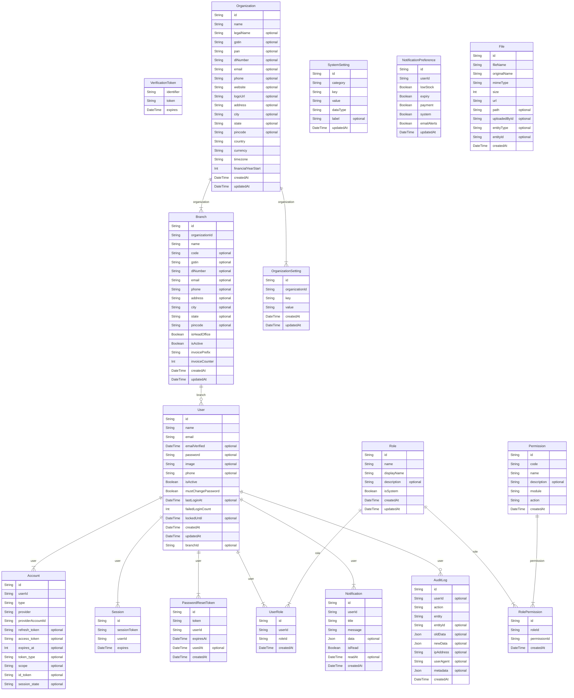

# Identity & Access, Organization, Audit & Config

> Auto-generated by `scripts/graphify` — source of truth: `prisma/schema.prisma` · `models: 17` · `FK relations: 12` · `enums: 0`

## Models in this ERD

| Model | Table | Fields | Notes |
|---|---|---|---|
| `Account` | `accounts` | 13 |  |
| `PasswordResetToken` | `password_reset_tokens` | 7 |  |
| `Session` | `sessions` | 5 |  |
| `User` | `users` | 27 |  |
| `VerificationToken` | `verification_tokens` | 3 |  |
| `Permission` | `permissions` | 8 |  |
| `Role` | `roles` | 9 |  |
| `RolePermission` | `role_permissions` | 6 |  |
| `UserRole` | `user_roles` | 6 |  |
| `Branch` | `branches` | 23 |  |
| `Organization` | `organizations` | 22 |  |
| `OrganizationSetting` | `organization_settings` | 7 |  |
| `AuditLog` | `audit_logs` | 12 |  |
| `SystemSetting` | `system_settings` | 7 |  |
| `Notification` | `notifications` | 10 |  |
| `NotificationPreference` | `notification_preferences` | 8 |  |
| `File` | `files` | 11 |  |

---
*Auto-generated by Graphify — do not edit. Regenerate with `npm run graphify`.*
