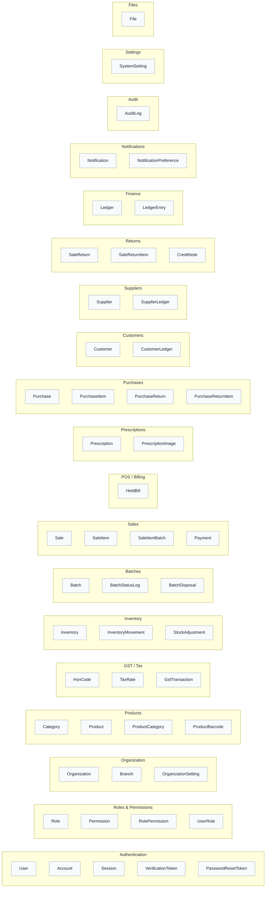

# Database Overview — all 50 models by module

> Auto-generated by `scripts/graphify` on 2026-09-14 from the actual repository files. Do not edit by hand — run `npm run graphify` to regenerate.

## Diagram

## What this graph represents

Every Prisma model grouped by its business module. This is a structural overview; the three following ERDs show fields and FK relations per domain.

## Source files

- `prisma/schema.prisma`

_See [../README.md](../README.md) for how to view and regenerate._
