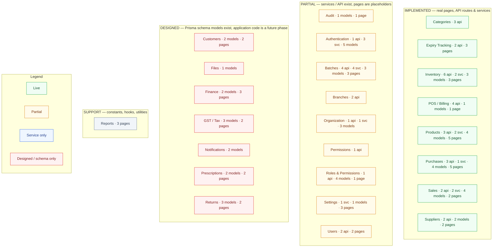

# Module / Feature Map

> Auto-generated by `scripts/graphify` on 2026-09-14 from the actual repository files. Do not edit by hand — run `npm run graphify` to regenerate.

## Diagram

## What this graph represents

Business modules shown in the PharmaCare navigation with their real implementation status. Status is derived from the codebase: pages (are they placeholders?), API route handlers, domain services and Prisma models per module.

## Source files

- `src/components/layout/sidebar.tsx (navigation)`
- `src/app/** (pages)`
- `src/app/api/** (API routes)`
- `src/lib/** (services)`
- `prisma/schema.prisma (models per module)`

_See [../README.md](../README.md) for how to view and regenerate._
