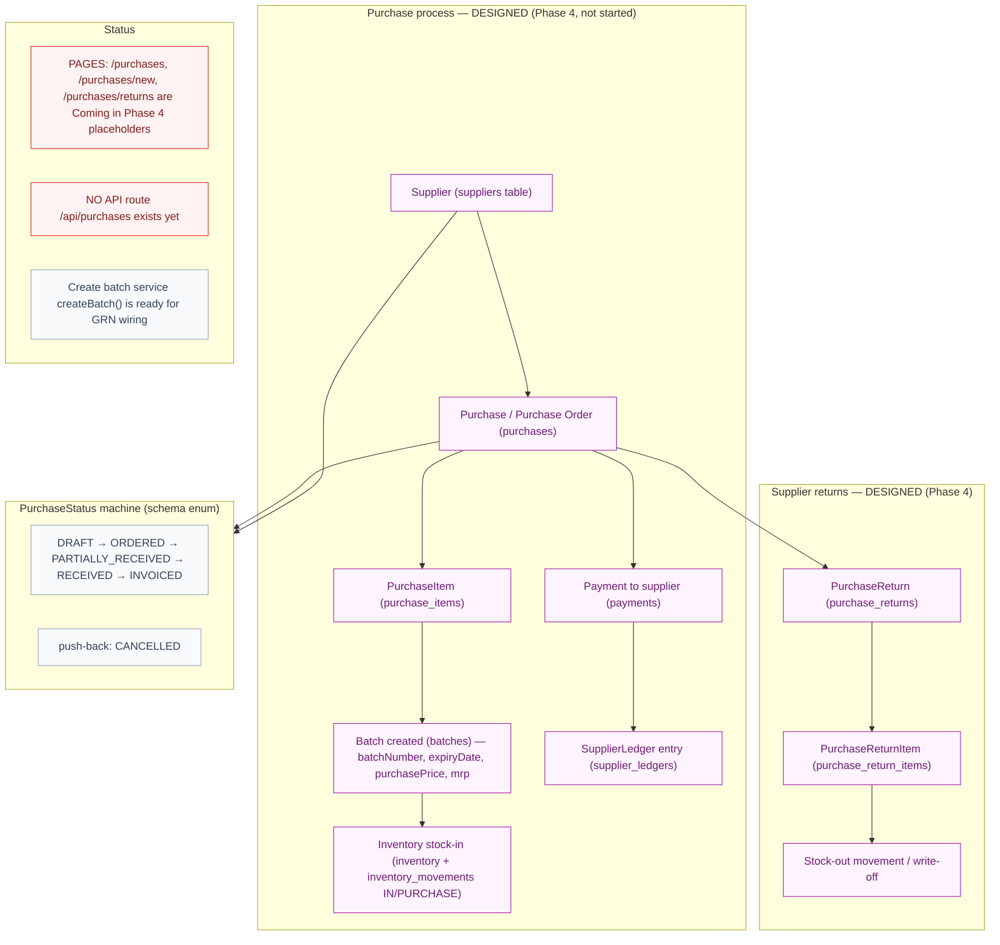

# Purchase Flow

> Auto-generated by `scripts/graphify` on 2026-09-14 from the actual repository files. Do not edit by hand — run `npm run graphify` to regenerate.

## Diagram

## What this graph represents

The purchase lifecycle as modelled in the Prisma schema (Purchases, Suppliers, Batches, Inventory, Finance). Phase 4 is not started: these are DESIGNED entities and flows, not yet implemented application code.

## Source files

- `prisma/schema.prisma (Purchase, PurchaseItem, PurchaseReturn, PurchaseReturnItem, Supplier, SupplierLedger, Batch)`
- `src/app/(dashboard)/purchases/** (placeholder pages)`
- `src/lib/batches/batch-service.ts (createBatch readiness)`

_See [../README.md](../README.md) for how to view and regenerate._
