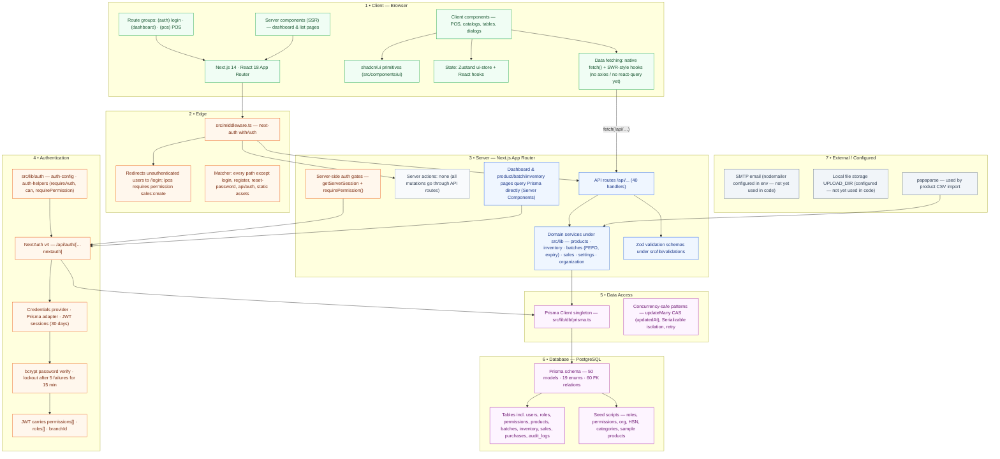

# System Architecture

> Auto-generated by `scripts/graphify` on 2026-09-14 from the actual repository files. Do not edit by hand — run `npm run graphify` to regenerate.

## Diagram

## What this graph represents

How the PharmaCare layers fit together: Next.js App Router UI, NextAuth JWT sessions, domain services, API routes, the Prisma client and PostgreSQL. Drawn from the actual files in src/ and prisma/.

## Source files

- `src/app/** (route groups layout.tsx / page.tsx)`
- `src/components/**`
- `src/middleware.ts`
- `src/lib/**`
- `prisma/schema.prisma`
- `next.config.js`

_See [../README.md](../README.md) for how to view and regenerate._
