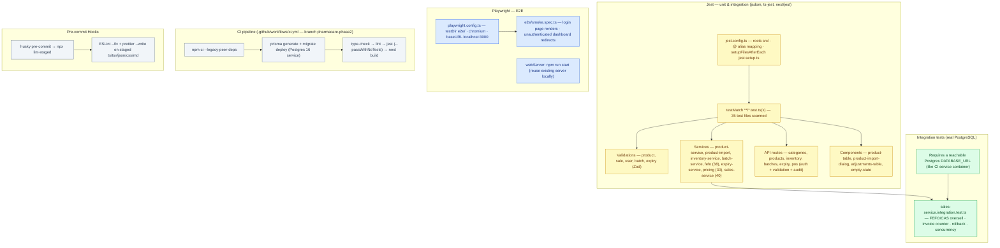

# Testing Architecture

> Auto-generated by `scripts/graphify` on 2026-09-14 from the actual repository files. Do not edit by hand — run `npm run graphify` to regenerate.

## Diagram

## What this graph represents

Three test layers (Jest unit/component, Prisma-backed integration, Playwright E2E) plus the CI pipeline and pre-commit hooking. Counts reflect the test files actually present in the repo.

## Source files

- `jest.config.ts`
- `jest.setup.ts`
- `src/**/*.test.ts(x)`
- `src/lib/sales/sales-service.integration.test.ts`
- `playwright.config.ts`
- `e2e/smoke.spec.ts`
- `.github/workflows/ci.yml`
- `.husky/pre-commit`

_See [../README.md](../README.md) for how to view and regenerate._
